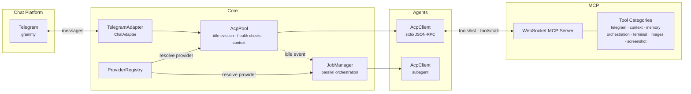

# hive-acp

An open source alternative to [OpenClaw](https://github.com/nicepkg/openclaw) focused on development workflows. Bridge that connects AI agents to messaging platforms using [ACP](https://agentclientprotocol.com) and [MCP](https://modelcontextprotocol.io), with isolated agent processes per conversation and persistent context.

Currently supports **Telegram** via [grammy](https://grammy.dev/), with an extensible `ChatAdapter` interface for adding more connectors.

## Architecture



### Key components

| Component | Description |
|---|---|
| `ChatAdapter` | Platform-agnostic interface for chat connectors (Telegram, Slack, etc.) |
| `AcpClient` | JSON-RPC 2.0 over stdio — communicates with a single agent process |
| `AcpPool` | Manages one `AcpClient` per chat with idle eviction, health checks, and context persistence |
| `ProviderRegistry` | Maps agent names to CLI providers, enabling multi-provider orchestration |
| `JobManager` | Dispatches tasks to subagents in parallel, emits progress events |
| `MCP Server` | WebSocket server exposing tool categories to the agent via the bridge |

## Features

- **Multi-provider** — mix Kiro, OpenCode, and Claude Code agents in the same workflow
- **Multi-agent orchestration** — dispatch tasks to subagents in parallel with real-time progress
- **Context persistence** — conversation summaries saved to disk on eviction, restored on reconnect
- **Knowledge graph** — SPO triples extracted from conversations, persisted across sessions
- **Built-in skills** — agent skills (e.g. Telegram formatting) auto-installed on first run
- **On-demand context management** — users can save, view, or clear context via natural language
- **Health checks** — idle clients pinged every minute, dead processes auto-removed
- **Idle eviction** — unused agents cleaned up after 30 minutes with automatic summarization
- **Structured logging** — JSON logs with queryable fields (pino)
- **Extensible** — add new chat platforms, providers, or tool categories without touching core logic

## Data directory

On first run, hive-acp creates `~/.hive-acp/` as its central home:

```
~/.hive-acp/
├── agents.json                 # OpenCode / Claude agent registry (auto + manual)
├── skills/                     # Agent skills (auto-installed from built-ins)
│   └── telegram-formatting/
│       └── SKILL.md
└── state/
    ├── triples.json            # Knowledge graph (SPO facts)
    └── summaries/              # Conversation summaries per chat
        └── <chatId>.md
```

## MCP Tools

### Telegram
| Tool | Description |
|---|---|
| `telegram_send_file` | Send a file from the workspace to the active chat |
| `telegram_react` | React to a message with an emoji |
| `telegram_download_attachment` | Download the last photo/document the user sent to `/tmp` and return the path |

### Context
| Tool | Description |
|---|---|
| `context_save` | Persist a conversation summary for the current chat |
| `context_show` | Display the saved summary |
| `context_clear` | Delete saved context and start fresh |

### Memory
| Tool | Description |
|---|---|
| `memory_search` | Search the knowledge graph for facts |
| `memory_add` | Add a fact (subject-predicate-object triple) |
| `memory_forget` | Remove facts matching a query |

### Orchestration
| Tool | Description |
|---|---|
| `agent_list` | List available subagents with their provider |
| `agent_dispatch` | Dispatch tasks to subagents in parallel |
| `agent_job` | Check status and results of a job |
| `agent_cancel` | Cancel a running job |

### Screenshot
| Tool | Description |
|---|---|
| `screenshot_url` | Take a screenshot of a URL and send it to the chat |

### Images
| Tool | Description |
|---|---|
| `images_search` | Search Pexels for free stock photos and send to chat |

### Terminal
| Tool | Description |
|---|---|
| `terminal_execute` | Execute a shell command in the workspace |

## Setup

### Prerequisites

- Node.js 20+
- An ACP-compatible CLI agent installed (Kiro, OpenCode, and/or Claude Code)
- A Telegram bot token from [@BotFather](https://t.me/BotFather)

### Installation

```bash
git clone git@github.com:hughcbscrt/hive-acp.git
cd hive-acp
npm install
```

### Configuration

```bash
cp .env.dist .env
```

Edit `.env` with your values:

#### General

| Variable | Required | Description |
|---|---|---|
| `HIVE_WORKSPACE` | | Directory for the agent to operate in (default: `cwd`) |
| `HIVE_MCP_PORT` | | WebSocket MCP server port (default: `4040`) |
| `HIVE_LOG_LEVEL` | | Pino log level (default: `info`) |

#### Provider

| Variable | Required | Description |
|---|---|---|
| `HIVE_PROVIDER` | | Main chat provider: `kiro`, `opencode`, `claude` (default: `kiro`) |

#### Kiro

| Variable | Required | Description |
|---|---|---|
| `HIVE_KIRO_CLI_PATH` | | Absolute path to `kiro-cli` binary (default: `kiro-cli` in PATH) |
| `HIVE_KIRO_AGENT` | | Agent name matching `~/.kiro/agents/<name>.json` |

#### OpenCode

| Variable | Required | Description |
|---|---|---|
| `HIVE_OPENCODE_CLI_PATH` | | Absolute path to `opencode` binary (default: `opencode` in PATH) |

> OpenCode also needs its provider API key configured. See [OpenCode docs](https://docs.opencode.ai/docs/config/) for details.

#### Claude

| Variable | Required | Description |
|---|---|---|
| `HIVE_CLAUDE_CLI_PATH` | | Absolute path to `claude-code-acp` binary (default: `claude-code-acp` in PATH) |

> Install the ACP bridge with `npm install -g @zed-industries/claude-code-acp`, and set `ANTHROPIC_API_KEY` in your environment.

#### Telegram

| Variable | Required | Description |
|---|---|---|
| `HIVE_TELEGRAM_TOKEN` | ✅ | Token from [@BotFather](https://t.me/BotFather) |
| `HIVE_ALLOWED_USERS` | | Comma-separated Telegram user IDs |

#### Pexels

| Variable | Required | Description |
|---|---|---|
| `HIVE_PEXELS_KEY` | | API key for image search (get from [pexels.com/api](https://www.pexels.com/api/)) |

### Creating agents

```bash
npm run create-agent
```

Interactive CLI that creates agents for any provider:
- **Kiro** → JSON in `~/.kiro/agents/<name>.json`
- **OpenCode** → Markdown in `~/.config/opencode/agents/<name>.md` + registered in `~/.hive-acp/agents.json`
- **Claude** → Markdown in `~/.config/claude/agents/<name>.md` + registered in `~/.hive-acp/agents.json`

### Running

```bash
# Development (watch mode)
npm run dev

# Production
npm run build
npm start
```

## Project structure

```
src/
├── index.ts                          # Entry point and boot sequence
├── acp/
│   ├── client.ts                     # ACP JSON-RPC client (stdio)
│   ├── pool.ts                       # Client pool with eviction, health checks, context
│   ├── registry.ts                   # ProviderRegistry — maps agents to providers
│   └── providers/
│       ├── types.ts                  # CliProvider / ResponseParser interfaces
│       ├── kiro.ts                   # Kiro CLI provider
│       ├── opencode.ts              # OpenCode CLI provider
│       └── claude.ts                # Claude Code CLI provider
├── adapters/
│   ├── chat/
│   │   ├── types.ts                  # ChatAdapter interface
│   │   └── telegram/
│   │       ├── adapter.ts            # Telegram ChatAdapter (grammy)
│   │       └── tools.ts             # Telegram MCP tools (send_file, react)
│   ├── context/
│   │   └── tools.ts                  # Context MCP tools (save, show, clear)
│   ├── images/
│   │   └── tools.ts                  # Pexels image search MCP tool
│   ├── screenshot/
│   │   └── tools.ts                  # Puppeteer screenshot MCP tool
│   └── terminal/
│       └── tools.ts                  # Terminal execute MCP tool
├── orchestration/
│   ├── job-manager.ts                # Subagent task orchestration
│   ├── context.ts                    # Dynamic orchestrator context builder
│   ├── tools.ts                      # Orchestration MCP tools (dispatch, job, cancel)
│   └── types.ts                      # Job, TaskEntry, JobEvent types
├── mcp/
│   ├── bridge.ts                     # stdio - WebSocket bridge
│   ├── handler.ts                    # MCP WebSocket protocol handler
│   └── types.ts                      # ToolCategory / ToolDefinition interfaces
├── memory/
│   ├── types.ts                      # Triple interface
│   ├── store.ts                      # In-memory knowledge graph with JSON persistence
│   └── tools.ts                      # Memory MCP tools (search, add, forget)
├── cli/
│   └── create-agent.ts              # Interactive agent creation CLI
├── skills/
│   └── telegram-formatting/
│       └── SKILL.md                  # Built-in Telegram formatting skill
└── utils/
    ├── env.ts                        # dotenv loader
    ├── logger.ts                     # Pino structured JSON logger
    ├── paths.ts                      # Central paths (~/.hive-acp/) and bootstrap
    ├── pkg.ts                        # package.json reader
    ├── typed-emitter.ts              # Type-safe EventEmitter wrapper
    ├── telegram-html.ts              # Markdown→HTML conversion and message splitting
    └── throttle.ts                   # Outbound rate limiter with RetryAfter handling
```

## Adding a new provider

1. Create `src/acp/providers/<name>.ts` returning a `CliProvider`
2. Register it in `buildRegistry()` in `src/index.ts`
3. Add `HIVE_<NAME>_*` variables to `.env.dist`

The `CliProvider` interface:

```typescript
interface CliProvider {
  name: string;
  bin: string;
  args: string[];
  env?: Record<string, string>;
  capabilities: Record<string, any>;
  agentFlag?: string; // CLI flag to select agent (e.g. "--agent")
  injectMcpBridge?: boolean; // set false if the provider wires the MCP bridge itself
}
```

## Adding a new chat adapter

1. Create `src/adapters/chat/<platform>/adapter.ts` implementing `ChatAdapter`
2. Create `src/adapters/chat/<platform>/tools.ts` returning a `ToolCategory`
3. Register it in `src/index.ts`

The `ChatAdapter` interface:

```typescript
interface ChatAdapter {
  getActiveContext(chatId?: number): ChatContext | null;
  sendResponse(chatId: number, text: string): Promise<void>;
  sendPhoto(chatId: number, filePath: string, caption?: string): Promise<void>;
  sendFile(chatId: number, filePath: string, caption?: string): Promise<void>;
  bindJobManager(jobManager: JobManager, pool: AcpPool): void;
  start(): void;
  stop(): void;
}
```

## License

MIT
